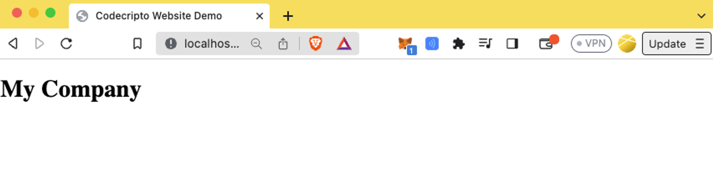

# React Template

> codecripto | From Web2 to Web 3 | Project Web Design | by JackyB

***

### Create a React Project

1. Open a terminal in your project directory.
2.  Create a new React project using the following command:

    ```bash
    npm create vite frontend
    ```

    * Choose "React" and "JavaScript."
3.  Navigate to the project directory:

    ```bash
    cd frontend
    ```
4.  Install project dependencies:

    ```bash
    npm install
    ```
5.  Start the development server:

    ```bash
    npm run dev
    ```
6. Visit the provided URL in your browser to see the template page.

### Clean Up the Template

1. Remove unnecessary project elements.
2. Remove CSS files or clear the content of `index.css`.
3. Delete the `App.jsx` component and `App.css` file.
4. In the `main.jsx` file, remove the import and usage of `App`, leaving only the desired content.
5. Check the structure on how the repo should look like:

```
frontend/
│
├── public/
│   ├── vite.svg
│
├── src/
│   ├── assets/
│   │   ├── images/
│   │   ├── styles/
│   │   │   └── index.css
│   │   └── ...
│   │
│   ├── main.jsx
│   ├── index.html
│   └── ...
│
├── node_modules/
│
├── package.json
├── package-lock.json
├── .gitignore
├── README.md
└── ...

```

## Install Bootstrap 5

1. Visit the Bootstrap 5 website:



2. Copy the Bootstrap 5 code snippet from the "Quick start", go down to the point 2 **Include Bootstrap’s CSS and JS.**\
   \
   **Note:** Before including the bootstrap, the letter is as showing on the image below:

<figure><figcaption></figcaption></figure>

3. Add the Bootstrap 5 code snippet to your `index.html,` select all the code before the closing `</body>` tag and copy.

```html
<!DOCTYPE html>
<html lang="en">
  <head>
    <meta charset="utf-8" />
    <meta name="viewport" content="width=device-width, initial-scale=1" />
    <title>Codecripto Website Demo</title>
    <link
      href="https://cdn.jsdelivr.net/npm/bootstrap@5.3.2/dist/css/bootstrap.min.css"
      rel="stylesheet"
      integrity="sha384-T3c6CoIi6uLrA9TneNEoa7RxnatzjcDSCmG1MXxSR1GAsXEV/Dwwykc2MPK8M2HN"
      crossorigin="anonymous" />
    <script
      src="https://cdn.jsdelivr.net/npm/bootstrap@5.3.2/dist/js/bootstrap.bundle.min.js"
      integrity="sha384-C6RzsynM9kWDrMNeT87bh95OGNyZPhcTNXj1NW7RuBCsyN/o0jlpcV8Qyq46cDfL"
      crossorigin="anonymous"></script>
  </head>
  <body>
    <div id="root"></div>
    <script type="module" src="/src/app.jsx"></script>
  </body>
</html>
```

4. Change the src="/src/app.jsx

**Note:** After including the bootstrap, the letter is as showing on the image below:

<figure><figcaption></figcaption></figure>
